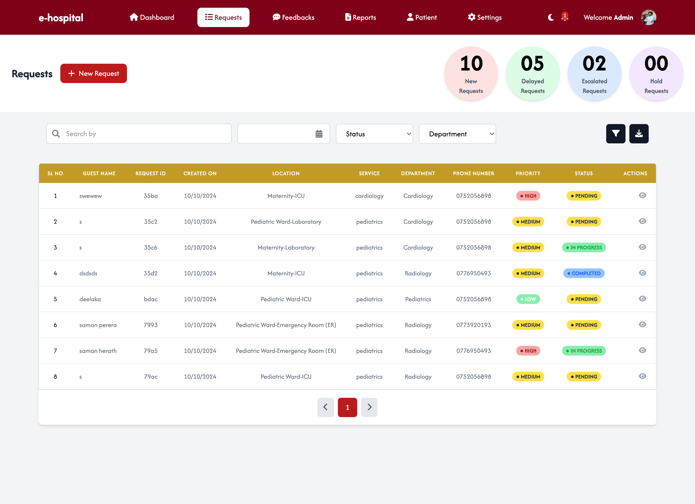
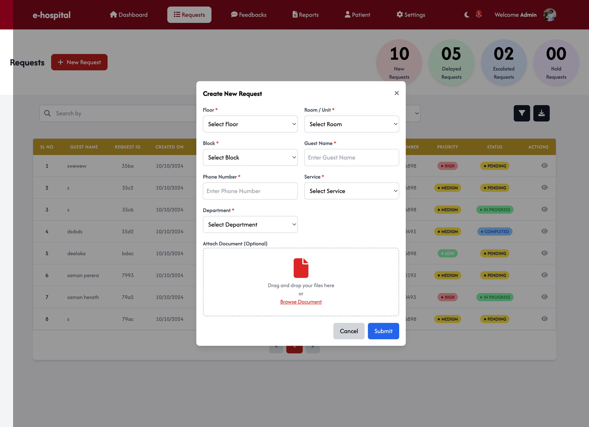
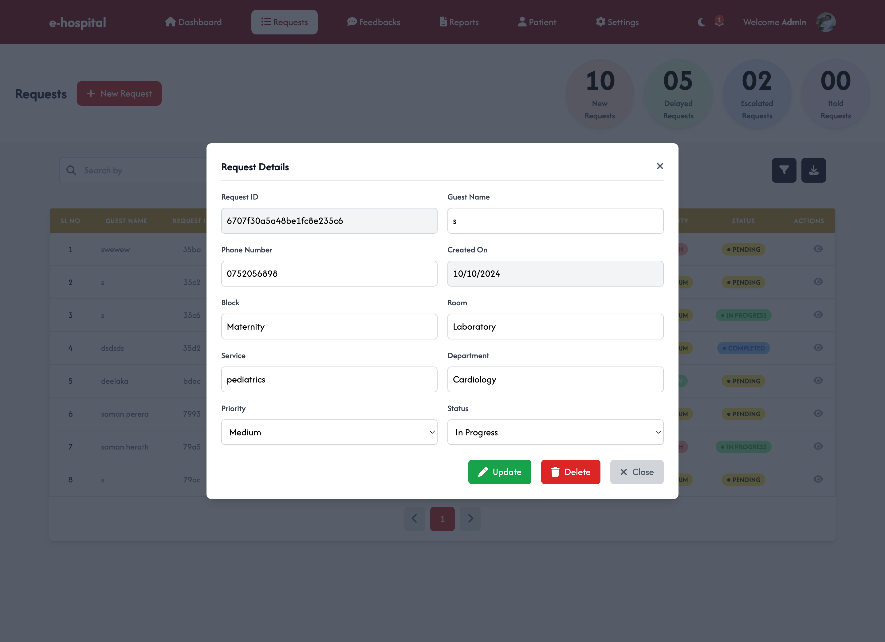

# E-Hospital Management System

E-Hospital is a comprehensive web-based hospital management system designed to manage hospital operations efficiently. It includes features such as patient management, doctor scheduling, and much more. This project has a fully functioning **front-end** and **back-end** to provide an end-to-end solution for hospital management.

[Visit the Live Website](https://skilltest01.netlify.app)

---

## Watch the Demo

[](https://youtu.be/9VzuVGOpdMw)


Click the image above to watch the full project demo.

---

## Screenshots

Here are some screenshots of the project:










---

## Project Setup

This project has separate **front-end** and **back-end** directories. Follow the steps below to set up both parts of the project.

### Prerequisites

Ensure that you have **Node.js** and **npm** installed on your machine.

### Front-end Setup

1. Navigate to the front-end folder:

    ```bash
    cd frontend
    ```

2. Install the necessary dependencies:

    ```bash
    npm install
    ```

3. Start the front-end development server:

    ```bash
    npm start
    ```

### Back-end Setup

1. Navigate to the back-end folder:

    ```bash
    cd backend
    ```

2. Install the necessary dependencies:

    ```bash
    npm install
    ```

3. Start the back-end development server:

    ```bash
    npm start
    ```

---

## GitHub Repository

You can find the full source code for this project in the [GitHub repository](https://github.com/DeelakaLakpura/E-Hospital).

---

## Tech Stack

- **Front-end**: React.js
- **Back-end**: Node.js, Express
- **Database**: MongoDB


---

## License

This project is licensed under the MIT License. See the [LICENSE](LICENSE) file for more details.
